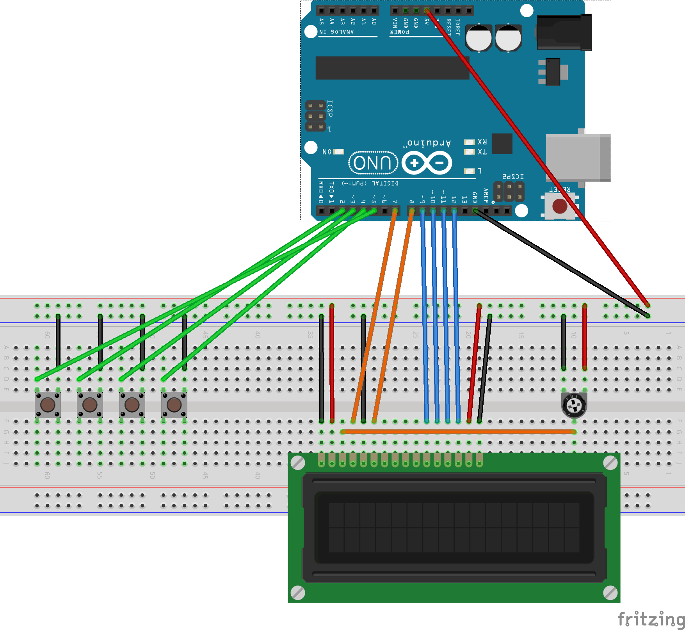

# Alarmuino

⚠️WIP

## Build process for computer

**Requirements**: `CMake`, a recent C++ compiler.

```
mkdir build
cd build
cmake -DCMAKE_BUILD_TYPE=Debug -G "CodeBlocks - Unix Makefiles" ../
make
./Alarmuino
./Tests
```

## Build process for Arduino



**Requirements**: [Arduino Makefile](https://github.com/sudar/Arduino-Makefile#requirements) with recent `avr-g++`.

```
make upload
```

To open serial monitor:
```
make monitor
```
It's a `screen` session, so to exit you can use `Ctrl-A`, `:` then type `quit`.
You can also use `detach`, and then `screen -r` to resume last session.

To launch tests:
```
cd tests
make upload monitor
```
:warning: Not all tests are supported on Arduino.
